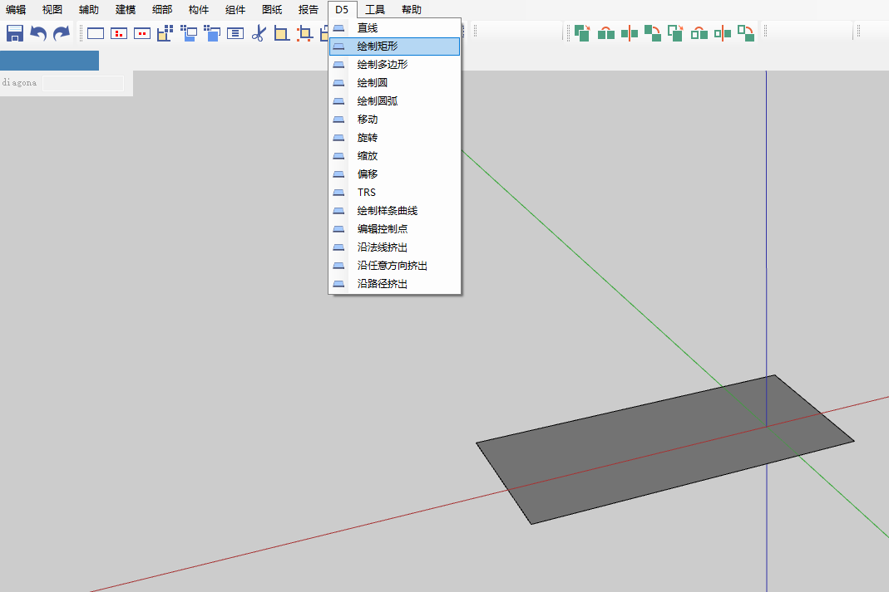
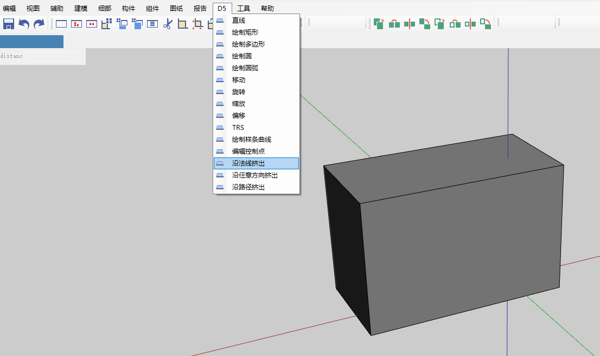

## 代码编译

把`config`和`fonts`放在`sketch\loongstc_bin\bin_debug`和`sketch\loongstc_bin\bin_release`目录下

## 代码注释

```
我现在正在熟悉一个项目的代码，项目大致是用C++进行的计算机图形学开发，但我C++基础比较差，请你给我分析讲解代码的功能以及对应的语法（尽量精炼并且通俗），我将代码以及代码之间关联的另一段代码都给你，如下：
注意你不用写示例代码，只需要给我说明我给你的代码是什么意思，对应的语法是什么意思（尽量通俗，方便我理解）
```

```
对于代码：
我现在能看懂这段代码，但是我仅仅是能理解，但如果让我从头写，我肯定是写不出来的，我现在想问，我应该如何理解开发的思路呢，哪些地方应该用哪些语法
```

```
精炼解释C++语法，解释代码的作用（根据命名猜测变量的含义，把语法的解释和功能的解释都放在代码的上一行注释中）
```

```
逐行解释代码的功能（根据命名猜测变量的含义，把功能的解释放在代码的上一行注释中，用于说明这段代码的作用是什么，这样写的意义是什么）
```

```
我想借助你的力量来先构建全局的认知，我给你的只是一部分的GeoData 关键词搜索结果，对于关键词搜索结果，我应该如何看待呢，才能尽快理清类的用途，类之间的关系，或者你觉得我们之间应该怎样合作呢？注意，现在我并不需要理论的概念的陈述，例如你说“构建全局认知”，我也知道，但我现在手里就只有没有任何注释和文档的代码，而且我的基础比较弱，所以我需要你直接告诉我，我们之间的合作方式
```

```
我现在正在学习计算机图形学的一个项目，项目几乎没有任何代码注释，而且我的计算机图形学才入门，所以我会给你提供.h文件，你看看以怎样的形式来分析这个文件，才能给我讲清楚代码的功能以及对应的计算机图形学的知识（越细越好）
```

```
我需要你仔细对照计算机图形学，来一点一滴的为我讲解代码，所以你不必一下子生成所有的代码解析，一步一步来，但要确保我能看懂代码的功能以及对应的图形学的知识，拜托了
```

```
我现在正在熟悉一个项目的代码，项目大致是用C++进行的计算机图形学开发，问题是代码没有什么注释，所以我需要你来分析geodata这个类代码的功能（可以根据命名猜测变量的含义），我先给你提供.h，让你大致了解类的功能，然后你对着.cpp分析，.h文件如下：
```

```
OK，现在你来分析下面这段代码的功能（注意，你不需要说额外的东西，例如推测推测场景之类的，也不需要重复写代码，你只需要为我尽可能分析代码的功能，用段落式的文本的形式尽可能精简描述即可，但是细节不可少）
```

## 功能解析

```
我现在正在研究计算机图形学的一个项目，项目几乎没有任何代码注释，我通过AI大致梳理出了类的代码功能（例如代码的语法作用是什么），但是，具体的代码是如何与实际操作的功能结合的，我还是不懂，而且我的计算机图形学基础也比较差，所以我现在会为你提供：项目的功能说明以及代码的初步说明，你需要仔细理解，然后我们再一起思考项目的功能具体是如何在代码中实现的，准备好了吗？
```

```
项目功能比较多，但我现在只研究"沿法线挤出"（如图所示）：
1. 如图一，我新建了矩形
2. 如图二，在第1点的基础上，选择"沿法线挤出"，这个功能的意思是对矩形的面进行法线方向的延展，延展的结果取决于我的鼠标移动，然后鼠标左键指定最终位置，我选中了那个矩形，然后朝着某个方向延展到了图二，形成了一个长方体

你先根据图片理解这个"沿法线挤出"的功能
```





```
上述描述就是我要研究的功能，其中，"沿法线挤出"这个动作是由"Controller_Extrude_Polygon"类完成的，而这个类又引入了"GeoData"类的东西（GeoData为Controller_Extrude_Polygon提供几何数据的基础），所以，这两个类的代码说明我都会给你（但这个注释是由AI生成的，我也不敢保证完全解读正确，所以还需要你深入思考），你准备好了吗
```

```
以下是Geodata这个类的头文件与源文件中的所有函数的说明
```

```
以下是Controller_Extrude_Polygon的详细说明
```

```
虽然我给你的是只是AI对代码的注释，但大致是没问题的，所以，我现在需要你结合项目的功能动作，结合计算机图形学，来给我讲解，Controller_Extrude_Polygon是如何实现"沿法线挤出"这个功能的
```

```
由于我的计算机图形学基础薄弱，代码也不懂，所以我现在需要你结合我提供的项目功能说明，以及代码的注释说明，来一步步为我讲清楚，这个功能的原理是什么，再说明Controller_Extrude_Polygon是如何实现的，我需要你提供一份目录，来说明你想怎么给我讲这个功能
```


## 知识扩充

```
我现在正在接触一个计算机图形学的项目，项目的大致目标是自己做的一个建模工具软件（有点像SketchUP），我现在负责的是多边形，未来会负责曲线曲面方向，但现在的问题是：

1. 项目工程已经形成了很大的基础，项目比较大，代码比较多，但是注释很少很少
2. C++的语法规则很容易学习，但计算机图形学内容实在是太多了，我一下子还难以捕捉到我应该学哪些

所以我打算把与我的工作直接相关的代码给你，你通过阅读代码，来告诉我，背后所依赖的需要我掌握的图形学知识是什么，需要我先看哪些，再看哪些
```

```
我给你提供的代码比较多，但你记住，你的任务并不是给我讲代码，而是浏览代码，然后分析背后的计算机图形学的知识，然后告诉我，方便我去学习
```

```
根据你上面对代码的观察，请你总结一下，我需要学习哪些算法，哪些方面的知识
```

项目涉及 几何数据结构、拓扑管理、三角剖分、几何计算、渲染 等核心内容。下面是 你需要学习的知识，并按 类别 和 优先级 进行整理。

### 计算几何（Computational Geometry）

核心目标：掌握点、线、面之间的关系计算，进行几何查询和裁剪

需要学习的算法

1. 点是否在多边形内部（Point-in-Polygon Test）
   - 射线法（Ray-Casting Algorithm）：判断点在多边形内部的最常见方法，复杂度 O(n)。
   - 奇偶规则（Even-Odd Rule）：射线与多边形边交点的奇偶性判断内部/外部。
   - 角度和法（Winding Number Algorithm）：适用于自交多边形的判断方法。
2. 线段求交（Line Segment Intersection）
   - 叉积法（Cross Product）：基于向量计算两条线是否相交，复杂度 O(1)。
   - Bentley-Ottmann 线段交点检测：适用于大量线段相交情况，复杂度 O(n log n)。
3. 多边形布尔运算（Boolean Operations on Polygons）
   - Sutherland-Hodgman 多边形裁剪：裁剪凸多边形，适用于渲染裁剪。
   - Weiler-Atherton 多边形裁剪：处理凹多边形裁剪，适用于复杂布尔运算。
   - Greiner-Hormann 裁剪算法：更通用的多边形相交、并、差运算方法。
4. 凸包计算（Convex Hull）
   - Graham 扫描法（O(n log n)）：求解最小凸包的常见方法。
   - Andrew’s Monotone Chain（O(n log n)）：高效计算凸包边界。
5. 最近点对问题（Closest Pair of Points）
   - 分治法（O(n log n)）：用于高效计算最近点对。
   - K-D 树（O(log n）：高效最近邻搜索方法，适用于大规模点集。

推荐学习资料

- 《Computational Geometry: Algorithms and Applications》（Mark de Berg）
- 《Real-Time Collision Detection》（Christer Ericson）

### 拓扑数据结构（Polygon & Mesh Topology）

核心目标：掌握几何数据的存储结构，支持高效的拓扑查询和操作

需要掌握的结构

1. 双向边表（DCEL - Doubly Connected Edge List）
   - 适用于 多边形编辑、拓扑修改。
   - 可高效查询 边-面-点的拓扑关系，常用于布尔运算。
2. 半边数据结构（Half-Edge Data Structure）
   - 适用于 三角网格（Triangle Mesh），用于存储网格结构。
   - Blender / OpenMesh 等软件常用，支持拓扑编辑。
3. 翼边结构（Winged-Edge Data Structure）
   - 适用于 多边形布尔运算、合并、裁剪，比 DCEL 复杂但适用于曲面处理。
4. Voronoi Diagram（如果要做区域分割）
   - Delaunay 三角剖分的对偶，用于 GIS、CAD、路径规划。

推荐学习资料

- 《Real-Time Rendering》（拓扑结构部分）
- 《Computational Geometry: Algorithms and Applications》（DCEL / Half-Edge）
- OpenMesh / CGAL（实践拓扑数据结构）

### 三角剖分（Triangulation）

核心目标：掌握将多边形分割成三角形的算法，以便渲染和计算

需要掌握的算法

1. Ear Clipping 三角剖分（O(n²)）
   - 适用于 简单多边形，代码实现简单。
   - 适用于低复杂度应用，如 GUI 建模工具。
2. Delaunay Triangulation（O(n log n)）
   - 生成高质量三角形，最大化最小角，减少细长三角形。
   - Bowyer-Watson 算法、Incremental Delaunay、Sweep Line Delaunay。
3. Constrained Delaunay Triangulation（CDT）
   - 处理带约束的三角剖分（保留边界），适用于 GIS、CAD、地图生成。
4. Polygon Triangulation with Holes
   - Seidel’s Algorithm（O(n log n)）：处理带洞多边形的高效剖分。
   - Ear Clipping with Holes（O(n²)）：适用于简单带洞多边形。

推荐学习资料

- CGAL（开源计算几何库）
- 《Computational Geometry: Algorithms and Applications》（Delaunay 三角剖分）

### 变换与投影（Transformations & Projection）

核心目标：掌握坐标变换、旋转、投影，支持 2D/3D 变换

需要掌握的数学

1. 齐次坐标（Homogeneous Coordinates）
   - 3D 变换使用 4x4 矩阵，保证平移可以用矩阵表示。
2. 仿射变换（Affine Transformations）
   - 平移（Translation）、旋转（Rotation）、缩放（Scaling）
3. 四元数（Quaternions）
   - 计算旋转矩阵，避免欧拉角万向锁问题。
4. 投影变换（Perspective & Orthogonal Projection）
   - 透视投影（Perspective Projection）
   - 正交投影（Orthographic Projection）

推荐学习资料

- 《计算机图形学：原理与实践》
- 《Fundamentals of Computer Graphics》
- OpenGL Red Book（OpenGL 矩阵变换）

### 渲染与显示（Rendering & Visualization）

核心目标：掌握渲染技术，优化几何数据的显示

需要掌握的渲染技术

1. GPU 渲染管线（Graphics Pipeline）
   - 顶点着色器（Vertex Shader）
   - 片元着色器（Fragment Shader）
2. 法线计算（Normal Computation）
   - 计算多边形的法向量
   - 法线贴图（Normal Mapping）
3. 包围盒（Bounding Volume）
   - AABB（Axis-Aligned Bounding Box）
   - OBB（Oriented Bounding Box）
   - BVH（Bounding Volume Hierarchy）

推荐学习资料

- OpenGL Superbible
- Real-Time Rendering

### 最终学习路径（建议优先级）

第一阶段（立刻学习，短期内掌握）

1. 拓扑数据结构（DCEL / Half-Edge / Winged-Edge）
2. 几何查询算法（点/线/多边形关系）
3. 三角剖分（Ear Clipping, Delaunay）
4. 矩阵变换（平移、旋转、缩放）

第二阶段（深入研究，增强能力） 5. 布尔运算（交并差） 6. 空间索引（加速几何计算） 7. 包围盒（AABB, OBB）

第三阶段（如果涉及 3D） 8. 法线计算 & 曲面细分 9. GPU 渲染（Shader & OpenGL） 10. 投影变换 & 透视变换

```
我大致明白你说的，需要我学习的东西，但对于系统学习，我认为还是看书比较合理，下面是《计算机图形学：原理、算法及实践》的目录，请你思考我应该阅读哪些内容
版权信息
内容简介
前言
第一部分
第1章 绪论
1.1 概念
1.2 研究内容及应用领域
1.3 发展历史
1.4 学科发展
第2章 图形开发工具及使用
2.1 VC++开发系统简介
2.2 VC++基本图素的绘制方法
第3章 基本图形的生成
3.1 直线的扫描转换
3.2 圆的扫描转换
3.3 椭圆的扫描转换
3.4 多边形的扫描转换及区域填充
3.5 字符和汉字的表示
3.6 线宽和线型处理
3.7 反走样技术
第4章 裁剪
4.1 点和直线的裁剪
4.2 多边形裁剪
4.3 圆裁剪
4.4 字符裁剪
第5章 图形变换
5.1 图形变换的数学基础
5.2 二维图形几何变换
5.3 三维图形几何变换
第6章 消隐技术
6.1 消隐相关概念及算法类型
6.2 凸多面体的消隐
6.3 一般多面体的消隐
第7章 真实感图形绘制
7.1 相关物理知识
7.2 光照模型
7.3 纹理
第8章 曲线曲面
8.1 曲线曲面基础知识
8.2 Bézier曲线曲面
8.3 B样条曲线曲面
8.4 NURBS方法
第9章 计算机动画与仿真
9.1 计算机动画与仿真的概念及基本原理
9.2 计算机动画与仿真的实现方法
9.3 计算机实时动画实践
第二部分
第10章 基于OpenG的图形开发技术
10.1 0penGL开发环境配置及相关规范介绍
10.2 基本图形及真实感图形绘制
10.3 OpenG图像处理技术
10.4 OpenGL纹理映射技术
10.5 OpenGL曲线曲面技术
第11章 Web图形开发技术
11.1 Web绘图技术的结构概述
11.2 Web环境下基本图形的生成
11.3 基于WebGL的3D图形参考文献
```

### ✅ 第一阶段（必须精读，直接影响你的工作）

#### 1. 基本图形的生成（第3章）

- 3.4 多边形的扫描转换及区域填充 ✅
  *你需要理解多边形的栅格化算法，因为它是渲染和几何计算的基础。*
- 3.7 反走样技术 ✅
  *涉及几何处理和渲染质量提升，在绘制复杂几何结构时很重要。*

#### 2. 裁剪（第4章）

- 4.1 点和直线的裁剪 ✅
  *你的 `GeoData` 代码中涉及点和线的裁剪，必须掌握 Cohen-Sutherland 线段裁剪算法。*
- 4.2 多边形裁剪 ✅
  *涉及多边形的布尔运算（交、并、差），你的 `GeoData` 代码涉及多边形拓扑修改，Sutherland-Hodgman 算法至关重要。*

#### 3. 图形变换（第5章）

- 5.1 图形变换的数学基础 ✅
  *掌握矩阵变换的数学原理，包括平移、旋转、缩放等。*
- 5.2 二维图形几何变换 ✅
  *你的 `GeoData` 代码涉及 2D 变换操作，需要理解仿射变换。*
- 5.3 三维图形几何变换 ✅
  *涉及 3D 变换（四元数、矩阵变换），未来扩展曲面建模时会用到。*

#### 4. 三角剖分 & 消隐（第6章）

- 6.1 消隐相关概念及算法类型 ✅
  *理解可见性计算，避免绘制隐藏部分的几何体，提高渲染效率。*

------

### ✅ 第二阶段（深入理解几何数据结构）

#### 5. 曲线曲面（第8章）

- 8.1 曲线曲面基础知识 ✅
  *如果你的 `GeoData` 代码未来要处理曲线，需要了解参数曲线的基本概念。*
- 8.2 Bézier 曲线曲面 ✅
  *涉及曲线建模和 CAD 建模工具的底层数学原理。*
- 8.3 B 样条曲线曲面 ✅
  *更通用的曲线拟合技术，比 Bézier 更适用于复杂模型建模。*

#### 6. 渲染与光照（第7章）

- 7.1 相关物理知识 ✅
  *渲染时的光照计算原理。*
- 7.2 光照模型 ✅
  *理解 Phong 光照模型，有助于实现更真实的 3D 视觉效果。*
- 7.3 纹理 ✅
  *纹理映射是现代 3D 渲染的重要部分。*

------

### ✅ 第三阶段（涉及 OpenGL & Web 方向）

#### 7. OpenGL 及 Web 图形（第10、11章）

- 10.1 OpenGL 开发环境配置及相关规范介绍 ✅
  *如果你的项目未来需要硬件加速，可以学习 OpenGL。*
- 10.2 基本图形及真实感图形绘制 ✅
  *掌握 OpenGL 的基本绘制流程，结合 `GeoData` 代码的渲染部分。*
- 11.3 基于 WebGL 的 3D 图形（可选）
  *如果你未来需要 Web 端建模工具，可以学习 WebGL 相关内容。*

------

### ⏳ 可以跳过的内容（不适用于你的项目）

🚫 第1章 绪论：图形学基础概述，可快速浏览。
🚫 第2章 图形开发工具：主要介绍 VC++ 开发，与你的 C++ 项目关系不大。
🚫 第9章 计算机动画与仿真：与你目前的建模工具无关，后期如果涉及动画再学。

------

### 🔥 学习建议

1. 第一阶段（精读 3, 4, 5, 6 章）：你需要快速掌握 几何计算、裁剪、变换、消隐 相关知识。
2. 第二阶段（深入 8, 7 章）：理解 曲线、渲染、光照，为曲面建模做准备。
3. 第三阶段（学习 OpenGL，扩展 Web 方向）：如果需要 加速渲染或 Web 端建模，可以学习 OpenGL/WebGL。

📚 推荐配合阅读：《Real-Time Rendering》、《Computational Geometry》💡

