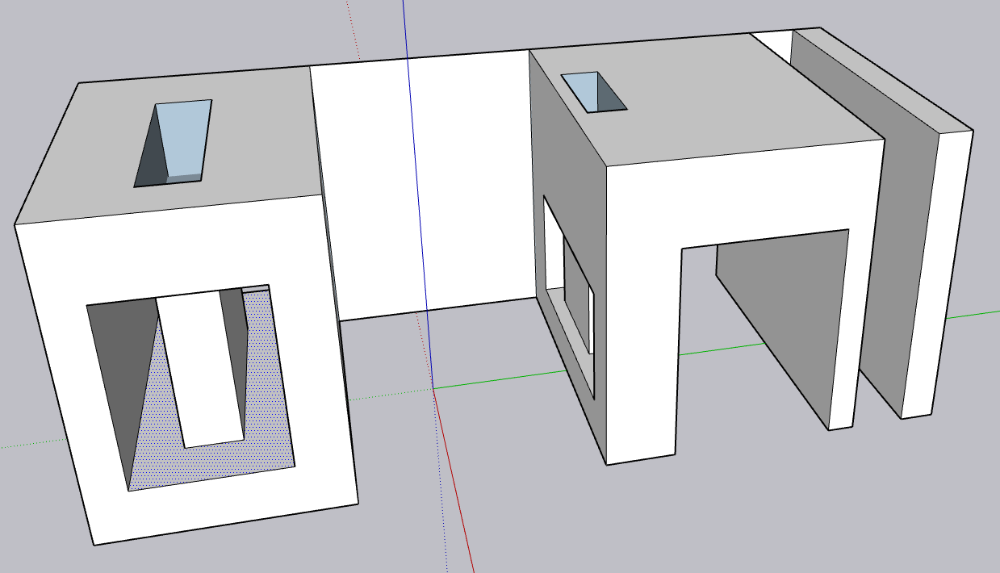

## 需求整理



## 问题分析

```
对于这个类，我正在排查功能对应的代码，现在实现的功能是：假设立方体有A和B两个面相对应，在已经创建好的立方体的A面上再创建一个小矩形X，然后沿法线挤出X'，然后想沿着法线挤出挤出到B面，也就是X'到B面，中间部分会被掏空，而且矩形X'的四条边也会在B面上保留（或者理解为X'面会在B面上保留），我想问，这个操作流程，在代码中是怎样的，我关注的点就是末端面X'的保留，请深度思考，这部分逻辑在代码中是怎样体现的
```

```
我现在想新增的功能就是：对于新生成的顶面X'，检查这个X'面是否被已经存在的面包含，例如X'面与B面重合了，此时应该删除X'面，这部分应该如何实现？（关于一些现有的方法与变量，你可以参考Geodata和GeoDataUtil两个类，并且如果是要新增一些工具性的方法，那么要加在GeoDataUtil类中）
```

```
我的目的是：在最终生成所有的确定的几何体时，我要对新增的顶面判断是否有与其他已经存在的面重合的情况，重合的话（也就是被包含）就删除这个新的顶面，判断方法可以借助其他类已经写好的工具方法，但在Controller_Extrude_Polygon这个类里面应该怎么写呢？写在哪里呢？
```

```
我现在想新增的功能就是：在MOVE模式下，在合并最终结果之前，得到新生成的顶面信息，这一步应该怎么做呢（只需要告诉我在哪里插入什么代码即可），注意，这部分操作应该是放在倒数的位置的
```

```
（先不讨论代码，只讨论算法）我的问题：
1. 【目的是在最终生成确定的几何体时，对新增的顶面进行与其他已存在面的重合判断】这个是在移动模式的最终合并操作之前进行对吧？我想确认的是，对新顶面的判断与删除应该是倒数的步骤，因为这个步骤不能影响其他的功能，这个逻辑是绝对不能影响其他逻辑的
2. 为什么要进行【将现有多边形转换为 geos::geom::Geometry 对象】
```

```
这部分被// add包含的代码是我新增的，新增之前的代码是完全没问题的，我的逻辑体现在注释中，现在代码编译没问题，但是运行的时候崩溃，现在崩溃在GeoDataUtils::get().get_polygon_positions(m_pick_mesh_doc->geodata().get(),...，请你检查代码的实现，使用正确的实现方法来完成注释的功能
```

```
现在的问题是：第一次新建矩形面，然后对新建的矩形面进行挤出操作，打印：

然后就崩溃了
```

```
我现在想新增的功能就是：对于新生成的顶面，检查这个面是否被已经存在的面包含（也就是存在重合关系），若重合了，那么删除这个新增的顶面面，这部分应该如何实现？（这部分的逻辑我都用//add框起来了，其他的代码是没问题的，我需要你检查//add部分代码有没有什么问题）
```

```
检查函数是否实现了目标功能，代码是否有错（目前没有报错语法错误，但不知道逻辑是否有错）
```

```
现在这套逻辑满足了基本上所有的沿法线挤出的需求，但有一个没有满足，就是：假设现在有一个的立方体，有 A 和 B 两个面是相对的。在 A 面上创建一个较小的矩形 X，对矩形面 X 沿法线挤出，假设挤出到 X' 面，如果刚好到 B 面，那么此时就需要删除X'与B面重合的部分，也就是说，X' 面是不得保留的，你先不着急写代码，而是先思考，怎样的算法才能实现这个新需求
```

```
你的方案：（1）碰撞检测增强（在need_flip_picked_normal方法中补充距离检测）；（2）末端面标记机制（在MoveExtrudeLineCorrespondPrim结构体中新增字段）；（3）偏移量处理逻辑修改（在create_move_operation_mesh中添加接触判断）；（4）末端面清除逻辑（在commit_extrude_mesh的MOVE模式分支中添加）；（5）几何校验增强（在fix_inferring_mesh_doc中补充空面检测）。这一套算法，从逻辑上来说是可以的，但我认为这并不是最好的，因为从效果上来说，我只需要检测的是，在MOVE模式下，两个doc的重合部分的删除，只要有重合就删除重合部分，也就是这样只需要操作merge就行了，大致是这样想的，但具体的算法需要你思考，你先思考这种方案的可行性
```

```
我的意思是，在merge的时候删除重合的部分即可，例如X'与B重合了，那么就删除重合的部分（X'），但我不知道Controller_Extrude_Polygon类关于这部分的代码是不是需要补充很多，我是不是需要在MOVE模式下单独增加一个模式之类的，你觉得怎样来实现比较方便，请注意不要钻牛角尖，只要最后能实现“删除B面上的X'重合的部分”就是可以的算法，你也可以思考是否有更加方便的实现算法
```

```
既然这个方法是可行的，那么现在我们就来着手实现，请你阅读我提供的三个头文件，这里面包括了很多工具方法，请你思考，我的算法要实现的话，如何利用这些类的操作（如果我需要新增对几何的某种工具操作，那么可以加在GeoDataUtil.h中，因为GeoDataUtil是GeoData的友元类，可以访问GeoData的私有成员）
```

```
将代码语句的解释以及功能的解释都以注释的方式插入到这段代码中
```

```
先观察函数的功能，在现在的基础上，以插入注释的形式，结合实际的操作，在函数头部解释整体功能，在函数内部解释各段代码，形式是：
// 函数功能：...
void function()
{
	code; // ...
}
```

```
这段代码在“沿法线挤出”操作中有什么用呢？请结合实际功能解释函数功能
```

## 解决方案

### 方案一

```
在现有的挤出逻辑中，当从立方体的面A挤出矩形X到对面B时，X'面（即挤出的末端面）会被保留，但用户希望在这种情况下X'面被自动删除，实现完全挖空的效果。 首先，我需要理解现有的代码逻辑。用户提供的代码中，Controller_Extrude_Polygon.cpp处理挤出操作，特别是在commit_extrude_mesh函数中处理最终的网格合并。根据之前的分析，末端面X'是通过在临时文档中创建，并在合并时保留的。 用户的问题指出，当挤出到对面的面B时，X'面应该被删除。这可能是因为在这种情况下，X'面与面B重合，导致不需要保留，否则会留下一个多余的面。因此，我需要找到在代码中判断挤出是否到达对面面B的条件，并在该情况下删除X'面。 接下来，我需要查看代码中处理合并的部分，特别是在commit_extrude_mesh函数中的相关逻辑。该函数处理两种模式：ADD和MOVE。在MOVE模式下，会合并m_move_inferring_mesh_doc到原始文档中。可能在合并前需要检查挤出是否到达限制，即是否碰到了对面的面B。 查看之前的代码，发现在create_move_operation_mesh函数中，有限制offset的逻辑，通过m_positive_offset_limit和m_negative_offset_limit来限制偏移量，这些限制可能是在prepare_move_mode_inferring_mesh中通过计算相邻面之间的距离得到的。如果offset达到了这些限制值，说明挤出面接触到了其他面，此时应删除末端面。 因此，解决方案可能是在合并操作前，检查当前的offset是否达到了限制值，如果是，则在合并时删除X'面。具体来说，在commit_extrude_mesh函数中，当检测到offset达到限制时，需要找到X'面对应的多边形并将其删除。 此外，在fix_inferring_mesh_doc函数中，处理临时文档的合并时，可能已经有跳过X'面的逻辑（如通过ring的key判断）。但如果需要删除X'面，可能需要在此处添加条件判断，当达到限制时，不保留该面。 需要考虑的步骤： 1. 在commit_extrude_mesh中，判断当前挤出是否达到了正或负的限制值。 2. 如果达到限制值，执行额外的步骤来删除末端面X'。 3. 在合并临时文档到原始文档前，删除对应的面。 需要检查代码中如何存储X'面的信息。在move模式下，X'面的拓扑信息存储在m_new_move_polygon_topo_arr中，可能在合并时需要检查这些面是否需要被删除。 可能的代码修改点： - 在commit_extrude_mesh的MOVE模式处理部分，检查offset是否达到限制，如果是，则遍历m_new_move_polygon_topo_arr中的面，并在合并前将其从m_move_inferring_mesh_doc中删除。 需要确保删除操作在合并前进行，并且不影响其他几何结构。此外，需要考虑如何准确判断是否到达对面面B，可能需要通过碰撞检测或距离计算来确认。 总结：关键点在于检测挤出是否到达对面面，并在合并时删除末端面。这可能需要修改commit_extrude_mesh函数，添加条件判断和删除操作。
```

### 方案二

```
用户希望当挤压生成的新面X'与现有面B重合时，自动删除X'。用户提到之前的方案可能过于复杂，想寻找更简便的方法。 首先，我需要理解当前代码的结构。用户提供的代码中，commit_extrude_mesh函数负责提交挤压操作后的网格。在MOVE模式下，合并m_move_inferring_mesh_doc到m_pick_mesh_doc后，需要检测并删除重合的面。 用户之前的方案是在merge之后遍历新面并进行射线检测，但可能存在性能问题或实现复杂性。我需要考虑是否有更高效的方式。 可能的思路是利用现有的几何库（如GEOS）进行面的相交检测。当合并后，可以比较新生成的面与现有面是否重合，如果重合则删除新面。这可能在合并前或合并后进行。 另一个考虑是，在生成新面时就预测是否会与现有面重合，从而避免生成多余的面。但可能难以准确预测，尤其是在复杂几何情况下。 回顾代码，发现merge操作后，m_pick_mesh_doc会包含合并后的几何数据。可以在merge之后，对新添加的面进行遍历，检查每个面是否与现有面重合，若重合则删除。 但如何高效识别新添加的面？可能在merge过程中标记新生成的面，或者在合并后通过比较差异来获取新增的面。 或者，在merge之后，对整个模型的几何进行全局检查，找出重合的面并删除。但这种方法可能在性能上有问题，尤其是模型复杂时。 用户希望简便实现，可能采用在merge之后，针对特定新面进行快速检测。例如，在MOVE模式下，新生成的面是m_new_move_polygon_topo_arr，可以在合并后检查这些面是否与现有面重合。 改进步骤可能包括： 1. 在commit_extrude_mesh的MOVE模式处理中，合并后遍历新生成的面。 2. 对每个新面，使用几何库检测是否与现有面重合。 3. 若重合，则从m_pick_mesh_doc中删除该面。 这需要访问m_pick_mesh_doc的GeoData，并实现面重合检测逻辑。利用现有的GEOS库函数进行面包含判断可能更高效。 此外，需要考虑面的朝向和容差，避免误删。例如，使用面的法线方向和几何包含关系来判断是否重合。 总结，最直接的修改是在合并后，对新面进行遍历，使用几何检测删除重合部分。这样不需要修改太多现有流程，且实现相对简单。
```

### 方案三

````
你先阅读下面的代码：

```
/*
 * 基于输入的 inputpolygon，计算 geodata 中与其共面的 polygon 的拓扑关系
 * 得到新的 polygon 中与其余 polygon 重叠的部分，以及重叠计算完毕后剩余的部分
 */
bool split_intersect_polygons(GeoData* geodata, const std::vector<std::vector<SketchPointPtr>>& input_polygon, const nous::vec3 input_pg_normal,
                              const std::unordered_set<SketchPolygonPtr>& coplane_polygons,
                              std::map<SketchPolygonPtr, std::vector<std::vector<std::vector<SketchPointPtr>>>>& split_pieces,
                              std::vector<std::vector<std::vector<SketchPointPtr>>>& remaining_pieces);

bool split_intersect_polygons(GeoData* geodata, const std::vector<std::vector<SketchPointPtr>>& input_polygon, const nous::vec3 input_pg_normal,
                              const std::unordered_set<SketchPolygonPtr>& coplane_polygons,
                              std::map<SketchPolygonPtr, std::vector<std::vector<std::vector<SketchPointPtr>>>>& split_pieces,
                              std::vector<std::vector<std::vector<SketchPointPtr>>>& remaining_pieces)
{
    // 存储临时生成用于拓扑运算的 Geometry 和原始 ring 对应的 skecthpolygon 之间的关系
    std::unordered_map<geos::geom::Geometry*, SketchPolygonPtr> geometry_to_prim_map;
    std::map<geos::geom::Coordinate, SketchPointPtr> ctpmap;

    // 这段代码将准备好输入的 skpolygon 和与其共面的所有 skpolygon 的 geometry
    geos::geom::Geometry* input_geom_polygon = convert::convert_polygon_to_geometry_with_revert_map(geodata, input_polygon, input_pg_normal, ctpmap);
    if(!input_geom_polygon || !input_geom_polygon->isValid())
    {
        return false;
    }

    for(const auto& polygon: coplane_polygons)
    {
        geos::geom::Geometry* geom_polygon = convert::convert_polygon_to_geometry_with_revert_map(geodata, polygon, ctpmap, &input_pg_normal);
        if(geom_polygon->isValid())
        {
            geometry_to_prim_map.insert({ geom_polygon, polygon });
        }
        else
        {
        }
    }

    // 将 input_polygon 的 geometry 对象和与其共面的所有 geometry 对象执行拓扑计算
    for(auto geom_prim_pair: geometry_to_prim_map)
    {
        geos::geom::Geometry* other_polygon = geom_prim_pair.first;

        // 若两个多边形完全不存在包含和被包含关系，则先简单判断两个多边形是否存在相交关系，若不存在相交关系，则无需进一步处理
        if(!input_geom_polygon->intersects(other_polygon))
        {
            continue;
        }

        // 这个函数会返回所有的 intersection 计算出的 polygon 的集合，将这些 polygon 转换成环，然后记录在 other_polygon 对应的外环中
        // 说明这个外环对应的 polygon 已经被切分出的一定的部分，后续需要 difference 运算进行拆分操作
        std::vector<geos::geom::Geometry*> intersection_result = geos_util::intersect_polygon(input_geom_polygon, other_polygon);

        // 为安全起见，intersects 的判断很可能包含一些【线重合】和【点重合】的情况，在 intersect_polygon 方法中会丢弃掉这些线和点
        // 所以 intersection_result 可能为空，为避免无效操作，此处需要多个判断
        if(!intersection_result.empty())
        {
            split_pieces.insert({ geom_prim_pair.second, std::vector<std::vector<std::vector<SketchPointPtr>>>() });

            // 对于每个被切分出的 polygon，将其转为 Point* 组成的 ring 对象
            // 与此同时，将这个部分与 input_geom_polygon 和 other_polygon 分别计算 difference
            for(auto child_geometry: intersection_result)
            {
                // 会内存泄露
                other_polygon = other_polygon->difference(child_geometry).release();
                input_geom_polygon = input_geom_polygon->difference(child_geometry).release();

                // 从 childpolygon 中的 Coordinate 反查 Point*
                geos::geom::Polygon* child_polygon = static_cast<geos::geom::Polygon*>(child_geometry);

                auto child_pg_pt_arr = convert::convert_geometry_to_polygon_with_revert_map(child_polygon, ctpmap);
                if(child_pg_pt_arr.size())
                    split_pieces[geom_prim_pair.second].emplace_back(std::move(child_pg_pt_arr));
            }

            // 全部裁切完毕后，other_polygon 的剩余部分也需要重新划分成不同的 polygon 加入返回的字典中
            std::vector<geos::geom::Geometry*> splited_polygon_parts = geos_util::extract_valid_polygons(other_polygon);
            for(auto splited_geometry: splited_polygon_parts)
            {
                geos::geom::Polygon* splited_polygon = static_cast<geos::geom::Polygon*>(splited_geometry);

                auto splited_pg_pt_arr = convert::convert_geometry_to_polygon_with_revert_map(splited_polygon, ctpmap);
                if(splited_pg_pt_arr.size())
                    split_pieces[geom_prim_pair.second].emplace_back(std::move(splited_pg_pt_arr));
            }
        }
    }

    // 此时 inputpolygon 已经和与其共面的 polygon 全部 intersection 解算完毕，剩余的部分作为单独的环加入其中
    std::vector<geos::geom::Geometry*> remained_geometries = geos_util::extract_valid_polygons(input_geom_polygon);
    for(auto remain_geometry: remained_geometries)
    {
        geos::geom::Polygon* remain_polygon = static_cast<geos::geom::Polygon*>(remain_geometry);

        auto remain_pg_pt_arr = convert::convert_geometry_to_polygon_with_revert_map(remain_polygon, ctpmap);
        if(remain_pg_pt_arr.size())
            remaining_pieces.emplace_back(std::move(remain_pg_pt_arr));
    }

    return true;
}
```

分析这个函数的功能逻辑
````


### 暂存函数

```cpp
// 函数功能：将一个用内外环坐标数组表示的 polygon 尝试加入 GeoData 对象
// @param polygon_pos 多边形的内外环坐标数组，第一个表示外环，其余表示内环
// @return polygon 的坐标加入 GeoData 后在其中对应的 Point*
std::vector<std::vector<SketchPointPtr>> GeoData::add_polygon_ly(const std::vector<std::vector<nous::pos_t>>& polygon_pos)
{
    // polygon split line，保证point/line/ring的拓扑正确，返回新的polygon拓扑。
    std::unordered_set<SketchPointPtr> recreat_line_points; // 存储需要重新创建的线段的点
    std::vector<std::vector<SketchPointPtr>> polygon_pt_arr;// 存储多边形的点

    // 遍历多边形的每个环
    for(const auto& ring: polygon_pos)
    {
        std::vector<SketchPointPtr>& ring_pt_arr = polygon_pt_arr.emplace_back();// 为当前环创建一个新的点数组
        for(int i = 0; i < ring.size(); ++i)
        {
            nous::pos_t p0 = ring[i];                    // 当前点
            nous::pos_t p1 = ring[(i + 1) % ring.size()];// 下一个点

            std::vector<SketchPointPtr> new_line_points;                      // 存储新线段的点
            std::map<SketchLinePtr, std::vector<SketchPointPtr>> recreat_line;// 存储需要重新创建的线段及其点
            _add_line(p0, p1, recreat_line, new_line_points);                 // 添加线段并获取需要重新创建的线段及其点

            // 旧line
            for(auto& rl: recreat_line)
            {
                GeoDataTopoOperations::get().replace_line(this, rl.first, rl.second);// 替换旧线段
            }
            // 新line
            if(new_line_points.size())
            {
                for(int i = 0; i < new_line_points.size() - 1; ++i)
                {
                    recreat_line_points.insert(new_line_points[i]);                       // 插入需要重新创建的线段的点
                    ring_pt_arr.push_back(new_line_points[i]);                            // 将新线段的点添加到当前环的点数组中
                    auto& cl = _add_nous_line(new_line_points[i], new_line_points[i + 1]);// 添加新线段
                }
                recreat_line_points.insert(new_line_points.back());// 插入需要重新创建的线段的最后一个点
            }
        }
    }
    nous::vec3 normal = sketch_math::ring_normal(polygon_pos[0]);// 计算多边形的法线
    
    // add

    /*
        // 完全重合检查
        std::cout << ">> 开始重合检查" << std::endl;

        bool is_fully_overlapping = true; // 标记新顶面是否与已有面完全重合

        // 如果新顶面和已有面顶点数量相同，进一步检查是否完全重合
        if(new_outer_ring.size() == existing_ring.size())
        {
            // 使用 unordered_set 存储已有面顶点，以便快速查找
            std::unordered_set<SketchPointPtr> existing_set(existing_ring.begin(), existing_ring.end());

            // 检查新顶面的所有点是否都在已有面中
            for(auto& p: new_outer_ring)
            {
                if(existing_set.find(p) == existing_set.end())
                {
                    std::cout << "发现新顶面点在已有面中找不到，说明不完全重合" << std::endl;
                    is_fully_overlapping = false;
                    break;
                }
            }
        }
        else
        {
            // 如果顶点数不同，肯定不可能完全重合
            std::cout << "新顶面与已有面顶点数不同，肯定不重合" << std::endl;
            is_fully_overlapping = false;
        }

        // 如果新顶面与已有面完全重合，则删除
        if(is_fully_overlapping)
        {
            std::cout << "新顶面与已有面完全重合，删除该顶面" << std::endl;
            return {};
        }
        std::cout << ">> 重合检查完成, 新顶面未与该已有面完全重合" << std::endl;
        */

    // 获取挤出操作的顶面拓扑（即新生成的顶面）
    std::vector<SketchPointPtr> new_outer_ring = polygon_pt_arr[0];

    // 计算新顶面的法线方向
    nous::vec3 new_outer_ring_normal = sketch_math::ring_normal(polygon_pos[0]);

    // 打印调试信息，表示开始检查新顶面
    std::cout << "====== 开始检查挤出的顶面 ======" << std::endl;

    // 遍历几何体中的所有已有多边形，检查新顶面是否需要删除
    std::cout << "开始判断包含或重合，此时已有面的数量: " << get_all_polygons().size() << std::endl;
    for(const auto& existing_polygon: get_all_polygons()) // 对于几何体中的某个已有面
    {
        // 获取当前已有面的法线方向
        nous::vec3 existing_normal = existing_polygon->normal;
        
        // 只检查与新顶面法线方向一致的面
        constexpr float epsilon = 1e-5f;
        if(new_outer_ring_normal.normalized().dot(existing_normal.normalized()) > (1.0 - epsilon))
        {
            std::cout << "法线一致，有判断的必要" << std::endl;
            std::vector<SketchPointPtr> existing_ring = GeoDataUtils::get().get_ring_topo(this, existing_polygon->ring);
            auto&& existing_ring_positions = GeoDataUtils::get().get_ring_positions(this, existing_ring);
            if(!sketch_math::plane_coplane_plane(new_outer_ring_normal, polygon_pos.front().front(), existing_normal, existing_ring_positions.front()))
            {
                continue;
            }

            // 包含检查
            std::cout << "开始包含检查" << std::endl;

            // 获取已有面的边界点
            
            bool is_fully_contained = true;   // 标记新顶面是否被完全包含
            bool has_point_onboundary = false;// 标记新顶面是否有点在已有面边界上
            bool has_point_outside = false;   // 标记新顶面是否有点在已有面外部

            // 遍历新顶面的所有顶点，检查它们在已有面中的位置关系
            for(size_t i = 0; i < new_outer_ring.size(); i++)
            {
                // 获取新顶面当前点的世界坐标
                nous::vec3 p = m_nous_position_handle.get(new_outer_ring[i]->point->idx());

                // 获取已有面的顶点坐标列表
                std::vector<nous::vec3> existing_ring_positions;
                for(const auto& sp: existing_ring)
                {
                    existing_ring_positions.push_back(m_nous_position_handle.get(sp->point->idx()));
                }

                // 计算当前点相对于已有面的拓扑关系（Inside, OnBoundary, Outside）
                topo::ESketchTopoRelation relation = topo::calc_point_and_ring_relation(existing_normal, p, existing_ring_positions);

                // 如果该点在已有面外部，则不可能被完全包含
                if(relation == topo::ESketchTopoRelation::Outside)
                {
                    std::cout << "新顶面有点在已有面外，说明不被包含" << std::endl;
                    has_point_outside = true;
                    is_fully_contained = false;
                    break;
                }
                // 如果该点在已有面边界上，则记录
                else if(relation == topo::ESketchTopoRelation::OnBoundary)
                {
                    std::cout << "新顶面有点在已有面边界，先记录" << std::endl;
                    has_point_onboundary = true;
                }
            }

            // 最终判断是否真正被包含：只有当所有点 Inside 且无 OnBoundary 时，才认为新顶面被完全包含，应删除
            if(is_fully_contained && !has_point_onboundary)
            {
                std::cout << "新顶面被已有面完全包含，删除该顶面" << std::endl;

                return {};
            }

            std::cout << "包含检查完成, 新顶面未被该已有面包含" << std::endl;
        }
        else
        {
            std::cout << "法线不一致，直接跳过判断，去检查其他的已有面" << std::endl;
        }
    }

    // 如果通过所有检查，则添加新面（顶面或者侧面）
    std::cout << "新顶面通过所有检查，添加到几何体中" << std::endl;
    this->add_polygon(polygon_pt_arr, new_outer_ring_normal);
    //if(// 正常的)
    //{
    //    this->add_polygon(polygon_pt_arr, new_outer_ring_normal);
    //}
    //else if(// 包含)
    //{
    //    this->add_line
    // 参考split_intersect_polygons（重合与包含可以合并），基本上修改这个，针对侧面两洞对面一洞，就直接全部删除，把add_polygon改为自己的substruct_polygon，然后把merge的add_polygon全部改为substruct_polygon应该会简单很多
    // 
    //}

    // add

    return polygon_pt_arr;// 返回多边形的点数组
}
```

