## 版本回退

Merge branch 'dev/fix_pull_push' into 'main'


## 调试排查

### 0209

```
我运行崩溃的时候，VS定位到了：这个来自于unordered_map文件（没有后缀名，在inlcude下面）

_NODISCARD mapped_type& at(const key_type& _Keyval) {
    const auto _Target = this->_Find_last(_Keyval, this->_Traitsobj(_Keyval));
    if (_Target._Duplicate) {
        return _Target._Duplicate->_Myval.second;
    }

    _Xout_of_range("invalid unordered_map<K, T> key");
}

出错在`_Xout_of_range("invalid unordered_map<K, T> key");`，对应的调用堆栈是
```

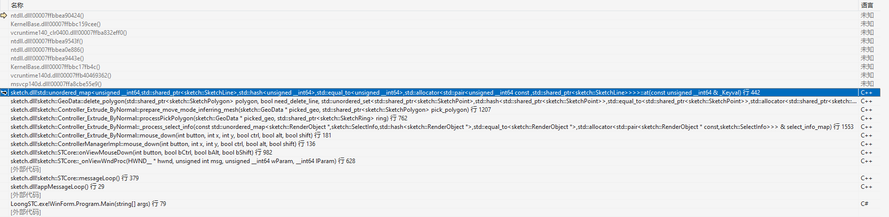

```
崩溃的那一行的上一行如图所示，然后点击这个，进入到了：

void GeoData::delete_polygon(SketchPolygonPtr polygon, bool need_delete_line, std::unordered_set<SketchPointPtr>* force_keeped_point_set)
{
    std::unordered_set<SketchLinePtr> line_set;

    if(need_delete_line)
    {
        std::vector<SketchPointPtr> exring_pt_arr;
        get_element_points(polygon->ring, exring_pt_arr);
        for(int i = 0; i < exring_pt_arr.size(); ++i)
        {
            SketchPointPtr prev_pt = exring_pt_arr[i];
            SketchPointPtr next_pt = exring_pt_arr[(i + 1) % exring_pt_arr.size()];

            const size_t line_key = GeoData::line_key(prev_pt, next_pt);
            line_set.insert(m_key_lines.at(line_key));
        }

        for(auto& inner_ring: polygon->inner_rings)
        {
            std::vector<SketchPointPtr> inring_pt_arr;
            get_element_points(inner_ring, inring_pt_arr);

            for(int i = 0; i < inring_pt_arr.size(); ++i)
            {
                SketchPointPtr prev_pt = inring_pt_arr[i];
                SketchPointPtr next_pt = inring_pt_arr[(i + 1) % inring_pt_arr.size()];

                const size_t line_key = GeoData::line_key(prev_pt, next_pt);
                line_set.insert(m_key_lines.at(line_key));
            }
        }
    }

    _delete_polygon(polygon);

    if(need_delete_line)
    {
        // 检查所有的 line 是否还被 ring 使用，不被使用的话移除这些 line
        for(auto line: line_set)
        {
            if(get_line_adj_rings(line).empty())
            {
                delete_line(line, true, true, force_keeped_point_set);
            }
            else
            {
                SketchPointPtr p0 = line->p0;
                SketchPointPtr p1 = line->p1;
                GeoDataTopoOperations::get().check_point_and_merge_line(this, p0, force_keeped_point_set);
                GeoDataTopoOperations::get().check_point_and_merge_line(this, p1, force_keeped_point_set);
            }
        }
    }

    m_dirty_flags |= 0x1;
    m_dirty_flags |= 0x2;
}

这个函数的line_set.insert(m_key_lines.at(line_key));，那我现在应该怎么做
```

### 0210

现在断点设置在Geodata的`line_set.insert(m_key_lines.at(line_key));`

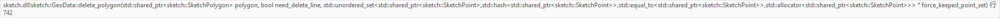

```
添加监视的结果如下
```

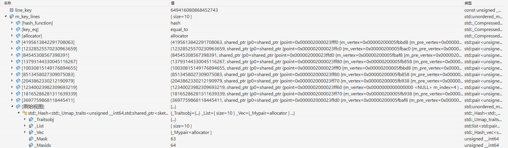

你可以这样调试

1️⃣ `F5` 运行 → 手动操作 UI，触发 `delete_polygon()`
2️⃣ 在 `line_key = GeoData::line_key(...)` 处打断点
3️⃣ 按 `F10` 观察 `line_key` 是否变化
4️⃣ 如果 `line_key` 计算可能有问题，用 `F11` 进入 `GeoData::line_key()` 细查
5️⃣ 如果误入 STL 或 API，按 `Shift + F11` 跳回外部代码

| 按键          | 作用                     | 适用于                               |
| ------------- | ------------------------ | ------------------------------------ |
| `F5`          | 继续运行，直到下一个断点 | 让 UI 正常运行，再触发断点           |
| `F10`         | 逐行执行，但不进入函数   | 跟踪 `line_key` 变化，不进入底层代码 |
| `F11`         | 逐行执行，并进入函数     | 查看 `GeoData::line_key()` 计算细节  |
| `Shift + F11` | 跳出当前函数，返回上层   | 如果误入 STL 或 UI 框架代码          |

```
如图一，我创建了矩形面，然后选择一个矩形面拉伸，然后再选择一个矩形面拉伸，此时，如图二，line_key是没问题的，m_key_lines也找得到

然后我再选择一个面（试图进行拉伸）然后我一直点击"继续执行"，UI界面并没有执行到"拉伸"的那种操作，而是出现了如图三的bug

然后我点击"重试"，此时代码跳转和监视窗口到了图四
```

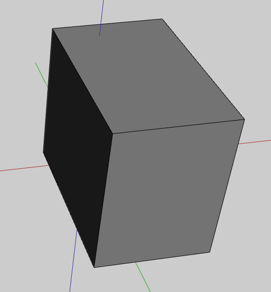

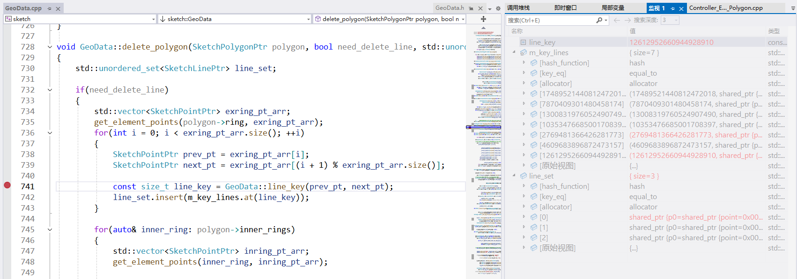

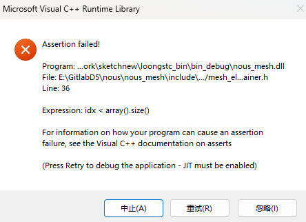

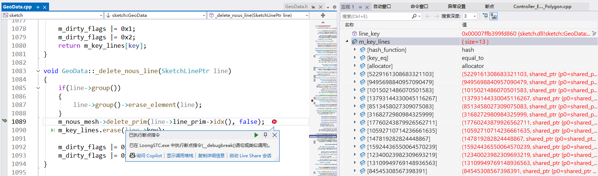

现在断点设置在Geodata的`m_nous_mesh->delete_prim(line->line_prim->idx(), false);`

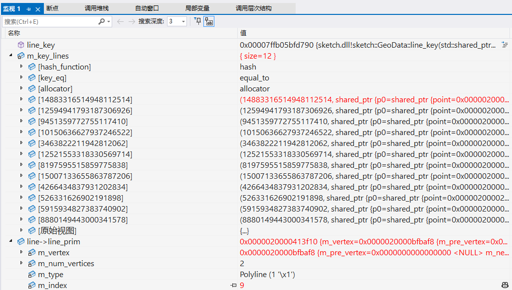

现在问题大概是delete_polygon删除line的时候，某个vertex消失了

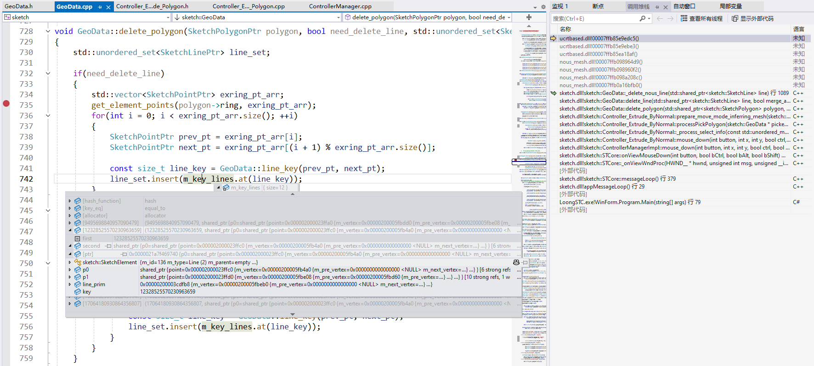

### 0211

```
现在出了问题，如图一，我创建了矩形面，然后选择一个矩形面拉伸，沿法线挤出，变成了如图一的长方体，然后我再选择一个面（试图进行拉伸），结果，UI界面并没有执行到"拉伸"的那种操作，而是出现了如图二的bug 

然后我点击"重试"，此时代码跳转和监视窗口到了图三（代码定位到了geodata的delete_line函数）

你觉得接下来，我应该怎么排查问题呢
```


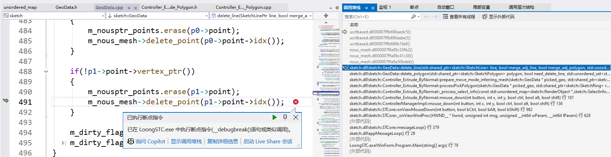

```cpp
在我选择矩形面的时候，依次执行了Controller_Extrude_Polygon和Geodata的某些函数，我按照调用堆栈把全部的函数代码给你

先执行：
void Controller_Extrude_ByNormal::mouse_down(int button, int x, int y, bool ctrl, bool alt, bool shift)
{
    if(button != 0)
        return;

    View* view = STCore::inst->viewMgr()->layout()->focusedView();
    auto& infer_info = view->inferHelper()->get_infer_result();
    auto select_info = view->selector()->get_select_info();
    if(m_extrude_step == ESketchExtrudeStep::PICK_ELEMENT)
    {
        if(select_info.size() == 1)
        {
            m_extrude_step = ESketchExtrudeStep::EXTRUDE_BEGIN_FIXING;
        }
    }

    if(m_extrude_step == ESketchExtrudeStep::EXTRUDE_BEGIN_FIXING)
    {
        RvtBlock blk(view->doc()->scene()->rvtId());
        if(!_process_select_info(select_info))
        {
            m_extrude_step = ESketchExtrudeStep::PICK_ELEMENT;
            return;
        }

        if(m_move_inferring_mesh_doc)
        {
            view->inferHelper()->add_ignore(m_move_inferring_mesh_doc->renderObject());
            m_move_inferring_mesh_doc->dirty();
        }
        if(m_add_inferring_mesh_doc)
        {
            view->inferHelper()->add_ignore(m_add_inferring_mesh_doc->renderObject());
            m_add_inferring_mesh_doc->dirty();
        }
        if(m_splited_old_mesh_doc)
        {
            view->inferHelper()->add_ignore(m_splited_old_mesh_doc->renderObject());
            m_splited_old_mesh_doc->dirty();
        }
        if(m_copyed_origin_mesh_doc)
        {
            view->inferHelper()->add_ignore(m_copyed_origin_mesh_doc->renderObject());
            m_copyed_origin_mesh_doc->dirty();
        }

        m_extrude_step = ESketchExtrudeStep::EXTRUDE_FIXING;
        if(m_pick_mesh_doc)
        {
            m_pick_mesh_doc->dirty();
            m_is_extrude_nurbs = false;
        }
        if(m_pick_nurbs_doc)
        {
            m_extrude_polygon_begin_position = view->inferHelper()->get_infer_result().position;
            m_pick_polygon_normal = infer_info.normal;
            m_pick_nurbs_doc->dirty();
            m_is_extrude_nurbs = true;
        }
    }
    else if(m_extrude_step == ESketchExtrudeStep::EXTRUDE_FIXING)
    {
        RvtBlock blk(view->doc()->scene()->rvtId(), true);
        commit_extrude_mesh();
        view->inferHelper()->clear_ignore();
        view->inferHelper()->set_infer_filter_type(InferType::POLYGON);
    }

    return;
}
执行到这个函数的if(!_process_select_info(select_info))

再执行：
bool Controller_Extrude_ByNormal::_process_select_info(const std::unordered_map<RenderObject*, SelectInfo>& select_info_map)
{
    int valid_element_number = 0;

    m_selected_algebra_surface = nullptr;
    m_selected_closed_surface = nullptr;
    m_selected_complex_surface = nullptr;

    for(auto& select_pair: select_info_map)
    {
        if(select_pair.first->type() == Define::ObjectType::OBJ_D5_MESH)
        {
            if(select_pair.second.elements.size() > 1 || valid_element_number > 0)
            {
                if(select_pair.second.elements.begin()->get()->to_polygon())
                {
                    valid_element_number += select_pair.second.elements.size();
                    break;
                }
            }

            for(auto& ele: select_pair.second.elements)
            {
                if(ele->to_polygon())
                {
                    m_pick_mesh_doc = dynamic_cast<MeshDoc*>(select_pair.first->doc());
                    m_pick_nurbs_doc = nullptr;
                    GeoData* geodata = m_pick_mesh_doc->geodata(true).get();
                    this->processPickPolygon(geodata, ele->to_polygon()->ring);
                    valid_element_number++;
                }
            }
        }

        if(select_pair.first->type() == Define::ObjectType::OBJ_D5_NURBS)
        {
            NurbsDoc* tmp_nurbs_doc = dynamic_cast<NurbsDoc*>(select_pair.first->doc());
            NurbsDataPtr picked_nurbs_data = tmp_nurbs_doc->nurbsdata(true);
            const Engine::Mat43 world_mat = tmp_nurbs_doc->world_matrix();
            const nous::mat4 trans_mat = NousConvert::convert(world_mat);
            for(auto& ele: select_pair.second.elements)
            {
                if(ele->type() == EElementType::AlgebraSurface)
                {
                    m_pick_nurbs_doc = tmp_nurbs_doc;
                    m_pick_mesh_doc = nullptr;
                    m_selected_algebra_surface = ele->to_nurbs_algebra_surface();
                    valid_element_number++;
                }

                if(ele->type() == EElementType::ClosedSurface)
                {
                    m_pick_nurbs_doc = tmp_nurbs_doc;
                    m_pick_mesh_doc = nullptr;
                    m_selected_closed_surface = ele->to_nurbs_closed_surface();
                    valid_element_number++;
                }

                if(ele->type() == EElementType::ComplexSurface)
                {
                    m_pick_nurbs_doc = tmp_nurbs_doc;
                    m_pick_mesh_doc = nullptr;
                    m_selected_complex_surface = ele->to_nurbs_complex_surface();
                    valid_element_number++;
                }
            }
        }
    }

执行到这个函数的this->processPickPolygon(geodata, ele->to_polygon()->ring);

再执行：
void Controller_Extrude_ByNormal::processPickPolygon(GeoData* picked_geo, SketchRingPtr ring)
{
    // 将法线从模型空间旋转到世界空间
    Engine::Mat43 mat = m_pick_mesh_doc->world_matrix();
    SketchPolygonPtr pick_polygon = picked_geo->get_polygon(ring);
    m_pick_polygon_normal = pick_polygon->ring->normal;
    m_pick_polygon_normal = NousConvert::product_v3(mat, m_pick_polygon_normal - NousConvert::convert(mat.col[3]).normalized());

    m_extrude_polygon_begin_position = picked_geo->get_mesh()->prim_barycenter(ring->ring_prim->idx());

    // 这是处理多个离散内环的必要步骤，需要将多个相邻且离散的内环合并成一个进行后续的 extrude 计算
    std::vector<std::vector<SketchPointPtr>> pick_polygen_rings_topo;
    std::vector<SketchPointPtr> out_ring = GeoDataUtils::get().get_ring_topo(picked_geo, pick_polygon->ring);
    if(pick_polygon->inner_rings.size())
    {
        std::vector<std::vector<SketchPointPtr>> inner_rings;
        for(auto& inner_ring: pick_polygon->inner_rings)
        {
            auto& iv = inner_rings.emplace_back();
            GeoDataUtils::get().get_ring_topo(picked_geo, inner_ring, iv);
        }
        std::vector<std::vector<std::vector<SketchPointPtr>>> valid_polygons;
        geodata_topo::ring_difference_other_rings(picked_geo, out_ring, inner_rings, pick_polygon->ring->normal, valid_polygons);
        if(valid_polygons.size() == 1)
        {
            pick_polygen_rings_topo.insert(pick_polygen_rings_topo.end(), valid_polygons[0].begin(), valid_polygons[0].end());
        }
    }
    else
    {
        pick_polygen_rings_topo.emplace_back(std::move(out_ring));
    }

    m_selected_polygon_topo = pick_polygen_rings_topo;

    std::unordered_set<ObjectDoc*> hide_docs;

    prepare_add_mode_inferring_mesh();
    prepare_move_mode_inferring_mesh(picked_geo, pick_polygon);

    if(m_extrude_mode == ESketchExtrudeMode::MOVE)
    {
        if(m_add_inferring_mesh_doc && m_copyed_origin_mesh_doc)
        {
            hide_docs.insert(m_add_inferring_mesh_doc);
            hide_docs.insert(m_copyed_origin_mesh_doc);
        }
    }
    else
    {
        if(m_move_inferring_mesh_doc && m_pick_mesh_doc)
        {
            hide_docs.insert(m_move_inferring_mesh_doc);
            hide_docs.insert(m_pick_mesh_doc);
        }
    }
    hide_docs.insert(m_splited_old_mesh_doc);

    // 隐藏这个用于恢复变更的 polygon
    View* view = STCore::inst->viewMgr()->layout()->focusedView();
    view->setHideObjects(hide_docs);

    if(m_add_inferring_mesh_doc)
    {
        m_add_inferring_mesh_doc->dirty();
    }

    if(m_move_inferring_mesh_doc)
    {
        m_move_inferring_mesh_doc->dirty();
    }

    m_pick_mesh_doc->dirty();
}

执行到这个函数的prepare_move_mode_inferring_mesh(picked_geo, pick_polygon);

再执行：
void Controller_Extrude_ByNormal::prepare_move_mode_inferring_mesh(GeoData* picked_geo, SketchPolygonPtr pick_polygon)
{
    // 判断是否需要做一个法线反向
    // 即如果有和这个面相接的面，这些面在当前面上的投影一定不能存在，否则不能向这个方向进行推动
    // 算一个其余面这个面所在平面上的投影，若两个多边形相交，则不能往这个方向推动，若两个法线方向均不可以，则不能做任何事情，直接返回
    // 若任意一个可以则需要把法线设置到对应的方向上去
    m_valid_move_dir = need_flip_picked_normal(picked_geo, pick_polygon);

    if(m_valid_move_dir == ESketchExtrudeMoveValidDir::None)
    {
        // 前后都移不了别搞了
        commit_extrude_mesh();
        return;
    }

    double move_delta = 0.1;
    if(m_valid_move_dir == ESketchExtrudeMoveValidDir::Negative)
    {
        move_delta = -move_delta;
    }
    m_move_last_offset = move_delta;

    View* view = STCore::inst->viewMgr()->layout()->focusedView();
    SceneDoc* scene = view->doc()->scene();
    if(m_move_inferring_mesh_doc)
    {
        view->delete_obj_and_try_delete_relation(m_move_inferring_mesh_doc);
        view->delete_obj_and_try_delete_relation(m_splited_old_mesh_doc);
        m_move_inferring_mesh_doc = nullptr;
        m_splited_old_mesh_doc = nullptr;
    }
    m_move_inferring_mesh_doc = (MeshDoc*)view->create_obj_in_working_group(Define::OBJ_D5_MESH);
    m_splited_old_mesh_doc = (MeshDoc*)view->create_obj_in_working_group(Define::OBJ_D5_MESH);

    std::unordered_map<SketchLinePtr, bool> line_corr_coplane_ring_map;

    // 基于选中的面，查找构成这个面的每条线段是否有与之共面的 polygon，若有则进行记录
    // 从处理逻辑上说可划分为以下三种
    // 1. 若一条边不存在与之共面的 ring，则需要创建一个新面
    // 2. 若一条边有与之共面的 ring，move 操作不需要创建一个新面，进入下面的分支逻辑
    //    2.1 若新的点的位置与之前共线，则直接更新点的位置即可
    //    2.2 若新的点的位置与之前不共线，则需要增加一条线段
    // 更大的问题是如何去处理 limit 的限制，目前按预置计算的逻辑处理

    std::unordered_set<SketchPointPtr> all_selected_point_arr;
    for(const auto& ring: m_selected_polygon_topo)
    {
        all_selected_point_arr.insert(ring.begin(), ring.end());
    }

    std::unordered_set<SketchRingPtr> self_rings;
    self_rings.insert(pick_polygon->ring);
    self_rings.insert(pick_polygon->inner_rings.begin(), pick_polygon->inner_rings.end());

    // 每条线对应可能存在的共面ring
    std::unordered_set<SketchPolygonPtr> need_delete_vertical_polygons;
    for(int i = 0; i < m_selected_polygon_topo.size(); ++i)
    {
        const auto& ring_pts = m_selected_polygon_topo[i];

        // 转一下 ring_pts 的顺序，一定要从非三点共线的位置开始做......
        std::vector<nous::pos_t> ring_pt_pos_arr;
        GeoDataUtils::get().get_ring_positions(picked_geo, ring_pts, ring_pt_pos_arr);
        int first_corner_idx = util::calc_ring_first_corner_index(ring_pt_pos_arr);

        std::vector<SketchPointPtr> fitted_ring_pts;
        if(first_corner_idx >= 0)
        {
            fitted_ring_pts.resize(ring_pts.size(), nullptr);
            for(int j = 0; j < ring_pts.size(); ++j)
            {
                fitted_ring_pts[j] = ring_pts[(j + first_corner_idx) % ring_pts.size()];
            }
        }
        else
        {
            fitted_ring_pts.insert(fitted_ring_pts.end(), ring_pts.begin(), ring_pts.end());
        }

        for(int j = 0; j < ring_pts.size(); ++j)
        {
            SketchPointPtr prev_point = ring_pts[j];
            SketchPointPtr next_point = ring_pts[(j + 1) % ring_pts.size()];

            SketchLinePtr line = picked_geo->get_line(GeoData::line_key(prev_point, next_point));
            bool has_coplane_polygon = false;

            // 改成是否只存在与其共面的 1-2 个 polygon
            auto adj_rings = picked_geo->get_line_adj_rings(line);
            auto valid_coplane_rings = get_valid_coplane_rings(adj_rings, self_rings, picked_geo);

            if(!valid_coplane_rings.empty())
            {
                has_coplane_polygon = true;

                // 先解决 Top 的那一圈 Point* 对应的是 inferring 中的哪些 Point*
                // 所以先把已有共享面的那部分加入进 inferring mesh
                for(SketchRingPtr coplane_ring: valid_coplane_rings)
                {
                    // line 作为 polygon 边界滑动，不可触碰到其余 polygon 或自己，即不能碰到任何其它环
                    SketchPolygonPtr inside_polygon = picked_geo->get_polygon(coplane_ring);
                    if(inside_polygon && need_delete_vertical_polygons.find(inside_polygon) == need_delete_vertical_polygons.end())
                    {
                        // 将临近 ring 影响到的全部 polygon 加入 old 用于恢复
                        std::vector<std::vector<nous::vec3>> polygon_positions;
                        GeoDataUtils::get().get_polygon_positions(picked_geo, inside_polygon, polygon_positions);
                        m_splited_old_mesh_doc->geodata()->add_polygon(polygon_positions);

                        // 计算可移动 limit 限制
                        std::optional<topo::SketchMoveLimitAloneDirection> limit = topo::calc_edge_move_distance_limit_alone_direction_in_polygon(
                            polygon_positions, picked_geo->get_point_position(prev_point), picked_geo->get_point_position(next_point),
                            m_pick_polygon_normal);
                        if(limit.has_value())
                        {
                            topo::SketchMoveLimitAloneDirection act_limit = limit.value();
                            if(act_limit.m_has_negative_limit)
                            {
                                m_negative_offset_limit = std::min(m_negative_offset_limit, act_limit.m_negative_distance_limit);
                            }

                            if(act_limit.m_has_positive_limit)
                            {
                                m_positive_offset_limit = std::min(m_positive_offset_limit, act_limit.m_positive_distance_limit);
                            }
                        }

                        std::vector<std::vector<nous::vec3>>&& offseted_polygon_positions =
                            get_offseted_polygon_positions(picked_geo, inside_polygon, prev_point, next_point, move_delta);
                        // m_move_inferring_mesh_doc->geometry()->add_polygon_without_check(offseted_polygon_positions, true);
                        GeoDataTopoOperations::get().add_polygon_without_split_line(m_move_inferring_mesh_doc->geodata().get(),
                                                                                    offseted_polygon_positions);
                        need_delete_vertical_polygons.insert(inside_polygon);
                    }

                    SketchPolygonPtr outside_polygon = picked_geo->get_parent_polygon(coplane_ring);
                    if(outside_polygon && need_delete_vertical_polygons.find(outside_polygon) == need_delete_vertical_polygons.end())
                    {
                        std::vector<std::vector<nous::vec3>> polygon_positions;
                        GeoDataUtils::get().get_polygon_positions(picked_geo, outside_polygon, polygon_positions);
                        m_splited_old_mesh_doc->geodata()->add_polygon(polygon_positions);

                        // 计算可移动 limit 限制
                        std::optional<topo::SketchMoveLimitAloneDirection> limit = topo::calc_edge_move_distance_limit_alone_direction_in_polygon(
                            polygon_positions, picked_geo->get_point_position(prev_point), picked_geo->get_point_position(next_point),
                            m_pick_polygon_normal);
                        if(limit.has_value())
                        {
                            topo::SketchMoveLimitAloneDirection act_limit = limit.value();
                            if(act_limit.m_has_negative_limit)
                            {
                                m_negative_offset_limit = std::min(m_negative_offset_limit, act_limit.m_negative_distance_limit);
                            }

                            if(act_limit.m_has_positive_limit)
                            {
                                m_positive_offset_limit = std::min(m_positive_offset_limit, act_limit.m_positive_distance_limit);
                            }
                        }

                        std::vector<std::vector<nous::vec3>>&& offseted_polygon_positions =
                            get_offseted_polygon_positions(picked_geo, outside_polygon, prev_point, next_point, move_delta);
                        // m_move_inferring_mesh_doc->geometry()->add_polygon_without_check(offseted_polygon_positions, true);
                        GeoDataTopoOperations::get().add_polygon_without_split_line(m_move_inferring_mesh_doc->geodata().get(),
                                                                                    offseted_polygon_positions);
                        need_delete_vertical_polygons.insert(outside_polygon);
                    }
                }
            }

            line_corr_coplane_ring_map.insert({ line, has_coplane_polygon });
        }
    }

    for(SketchPolygonPtr need_delete_skp: need_delete_vertical_polygons)
    {
        picked_geo->delete_polygon(need_delete_skp, true, &all_selected_point_arr);
    }

    // 也要把自己加到 old 里，恢复的时候直接用
    std::vector<std::vector<nous::vec3>> self_positions;
    GeoDataUtils::get().get_polygon_positions(picked_geo, m_selected_polygon_topo, self_positions);
    m_splited_old_mesh_doc->geodata()->add_polygon(self_positions);

    for(auto& pair: line_corr_coplane_ring_map)
    {
        SketchLinePtr line = pair.first;
        const bool& has_coplane_polygon = pair.second;

        // 已经找到垂直的 ring 的 line 直接 continue 就行
        if(has_coplane_polygon)
        {
            continue;
        }

        if(picked_geo->is_valid(line))
        {
            // 没有 prim 与之绑定的话，就要生成一个 ring 丢到 inferring 里去
            const nous::pos_t curr_pt_pos = m_pick_mesh_doc->geodata()->get_point_position(line->p0);
            const nous::pos_t next_pt_pos = m_pick_mesh_doc->geodata()->get_point_position(line->p1);
            const nous::pos_t new_curr_pt_pos = curr_pt_pos + m_move_last_offset * m_pick_polygon_normal;
            const nous::pos_t new_next_pt_pos = next_pt_pos + m_move_last_offset * m_pick_polygon_normal;

            std::vector<std::vector<nous::pos_t>> new_side_ring = { { curr_pt_pos, next_pt_pos, new_next_pt_pos, new_curr_pt_pos } };
            GeoDataTopoOperations::get().add_polygon_without_split_line(m_move_inferring_mesh_doc->geodata().get(), new_side_ring);
        }
        else
        {
            std::cout << "Line Key Not Found, Please Check!" << std::endl;
        }
    }

    for(int i = 0; i < self_positions.size(); ++i)
    {
        for(int j = 0; j < self_positions[i].size(); ++j)
        {
            self_positions[i][j] += m_move_last_offset * m_pick_polygon_normal;
        }
    }

    // 删掉现有的底
    picked_geo->delete_polygon(pick_polygon, true);
    m_pick_mesh_doc->dirty();

    // 替换为新的顶
    m_new_move_polygon_topo_arr = m_move_inferring_mesh_doc->geodata()->add_polygon(self_positions);
    for(const auto& ring_pt_arr: m_new_move_polygon_topo_arr)
    {
        for(auto& pt: ring_pt_arr)
        {
            m_new_move_polygon_topo.insert(pt);
        }
    }

    if(m_valid_move_dir == ESketchExtrudeMoveValidDir::None)
    {
        m_negative_offset_limit = 0.0;
        m_positive_offset_limit = 0.0;
    }
    else if(m_valid_move_dir == ESketchExtrudeMoveValidDir::Positive)
    {
        m_negative_offset_limit = 0.0;
    }
    else if(m_valid_move_dir == ESketchExtrudeMoveValidDir::Negative)
    {
        m_positive_offset_limit = 0.0;
    }
}

执行到这个函数的picked_geo->delete_polygon(need_delete_skp, true, &all_selected_point_arr);

再执行：
void GeoData::delete_polygon(SketchPolygonPtr polygon, bool need_delete_line, std::unordered_set<SketchPointPtr>* force_keeped_point_set)
{
    std::unordered_set<SketchLinePtr> line_set;

    if(need_delete_line)
    {
        std::vector<SketchPointPtr> exring_pt_arr;
        get_element_points(polygon->ring, exring_pt_arr);
        for(int i = 0; i < exring_pt_arr.size(); ++i)
        {
            SketchPointPtr prev_pt = exring_pt_arr[i];
            SketchPointPtr next_pt = exring_pt_arr[(i + 1) % exring_pt_arr.size()];

            const size_t line_key = GeoData::line_key(prev_pt, next_pt);
            line_set.insert(m_key_lines.at(line_key));
        }

        for(auto& inner_ring: polygon->inner_rings)
        {
            std::vector<SketchPointPtr> inring_pt_arr;
            get_element_points(inner_ring, inring_pt_arr);

            for(int i = 0; i < inring_pt_arr.size(); ++i)
            {
                SketchPointPtr prev_pt = inring_pt_arr[i];
                SketchPointPtr next_pt = inring_pt_arr[(i + 1) % inring_pt_arr.size()];

                const size_t line_key = GeoData::line_key(prev_pt, next_pt);
                line_set.insert(m_key_lines.at(line_key));
            }
        }
    }

    _delete_polygon(polygon);

    if(need_delete_line)
    {
        // 检查所有的 line 是否还被 ring 使用，不被使用的话移除这些 line
        for(auto line: line_set)
        {
            if(get_line_adj_rings(line).empty())
            {
                delete_line(line, true, true, force_keeped_point_set);
            }
            else
            {
                SketchPointPtr p0 = line->p0;
                SketchPointPtr p1 = line->p1;
                GeoDataTopoOperations::get().check_point_and_merge_line(this, p0, force_keeped_point_set);
                GeoDataTopoOperations::get().check_point_and_merge_line(this, p1, force_keeped_point_set);
            }
        }
    }

    m_dirty_flags |= 0x1;
    m_dirty_flags |= 0x2;
}

执行到这个函数的delete_line(line, true, true, force_keeped_point_set);

再执行：
void GeoData::delete_line(SketchLinePtr line, bool merge_adj_line, bool merge_adj_polygon, std::unordered_set<SketchPointPtr>* force_keeped_point_set)
{
    // ring
    std::vector<std::pair<SketchRingPtr, SketchRingPtr>> coplane_ring;
    std::unordered_set<SketchRingPtr> used_prim_set;
    std::unordered_set<SketchRingPtr> line_adj_rings = get_line_adj_rings(line);
    for(auto ring1: line_adj_rings)
    {
        if(used_prim_set.find(ring1) != used_prim_set.end())
        {
            continue;
        }

        used_prim_set.insert(ring1);
        bool find_coplane = false;

        const nous::vec3 ring1_normal = m_nous_mesh->prim_normal(ring1->ring_prim->idx());
        for(auto ring2: line_adj_rings)
        {
            if(ring1 == ring2)
            {
                continue;
            }

            const nous::vec3 ring2_normal = m_nous_mesh->prim_normal(ring2->ring_prim->idx());
            if(sketch_math::direction_parallel(ring1_normal, ring2_normal))
            {
                find_coplane = true;
                used_prim_set.insert(ring2);
                auto& pair_data = coplane_ring.emplace_back();
                pair_data.first = ring1;
                pair_data.second = ring2;
                break;
            }
        }

        if(!find_coplane)
        {
            auto& pair_data = coplane_ring.emplace_back();
            pair_data.first = ring1;
            pair_data.second = nullptr;
        }
    }
    used_prim_set.clear();

    GeoDataTopoOperations::get().merge_coplane_ring_and_polygon(this, coplane_ring, merge_adj_polygon);

    // line
    SketchPointPtr p0 = line->p0;
    SketchPointPtr p1 = line->p1;
    this->_delete_nous_line(line);

    if(merge_adj_line)
    {
        if(!force_keeped_point_set || (force_keeped_point_set && force_keeped_point_set->find(p0) == force_keeped_point_set->end()))
        {
            GeoDataTopoOperations::get().check_point_and_merge_line(this, p0, force_keeped_point_set);
        }

        if(!force_keeped_point_set || (force_keeped_point_set && force_keeped_point_set->find(p1) == force_keeped_point_set->end()))
        {
            GeoDataTopoOperations::get().check_point_and_merge_line(this, p1, force_keeped_point_set);
        }
    }

    if(!p0->point->vertex_ptr())
    {
        m_nousptr_points.erase(p0->point);
        m_nous_mesh->delete_point(p0->point->idx());
    }

    if(!p1->point->vertex_ptr())
    {
        m_nousptr_points.erase(p1->point);
        m_nous_mesh->delete_point(p1->point->idx());
    }

    m_dirty_flags |= 0x1;
    m_dirty_flags |= 0x2;
}

执行到这个函数的m_nous_mesh->delete_point(p1->point->idx());
    
然后就报错了，你觉得我应该怎么找出问题所在呢？写log比较麻烦，我用的是VS2022，有没有更好的定位问题的办法
```

```
添加的断点分别是：
1. m_nous_mesh->delete_point(p0->point->idx());，条件断点，p0 == nullptr || p0->point == nullptr
2. m_nous_mesh->delete_point(p1->point->idx());，条件断点，p1 == nullptr || p1->point == nullptr
3. m_nous_mesh->delete_prim(line->line_prim->idx(), false);，条件断点，line->p0 == nullptr || line->p1 == nullptr

添加的监视分别是：
line_key
m_key_lines
line->line_prim
line->p0->point->m_vertex
line->p1->point->m_vertex
p0->point
p1->point
```

### 0212

```
Geodata与Controller_Extrude_Polygon类都是经过修改的，修改之前，这个"沿法线挤出"功能是没问题的，修改之后，出现了现在的问题，但是Geodata是没问题的，因为它只提供了基本的操作，所以问题是现在的Controller_Extrude_Polygon无法匹配现在的Geodat

现在的问题是，delete_polygon和delete_line都是geodata的东西，调用关系是：Controller_Extrude_Polygon类的picked_geo->delete_polygon(need_delete_skp, true, &all_selected_point_arr);调用delete_polygon，delete_polygon再调用delete_line

你觉得我应该怎样，才能找到问题所在呢，请提供你的见解
```

### 0213

15条线，10个点，ring是5个

### 0214

```
可能出错的函数：
add_polygon_without_split_line
fix_inferring_mesh_doc
prepare_move_mode_inferring_mesh
```

```
我现在在对fix_inferring_mesh_doc函数排查问题：

void Controller_Extrude_ByNormal::fix_inferring_mesh_doc()
{
    if(m_move_inferring_mesh_doc)
    {
        GeoData* inferring_geodata = m_move_inferring_mesh_doc->geodata().get();
        std::unordered_set<SketchPolygonPtr> all_sketch_polygons = inferring_geodata->get_all_polygons();

        std::vector<std::vector<std::vector<nous::pos_t>>> splited_polygon_positions;
        for(SketchPolygonPtr polygon: all_sketch_polygons)
        {
            if(polygon->ring->key == GeoData::ring_key(m_new_move_polygon_topo_arr.front()))
            {
                continue;
            }

            std::vector<std::vector<std::vector<SketchPointPtr>>> splited_polygons;
            std::vector<std::vector<SketchPointPtr>> polygon_topo = GeoDataUtils::get().get_polygon_topo(inferring_geodata, polygon);
            std::vector<std::vector<SketchPointPtr>> polygon_inner_topo;
            polygon_inner_topo.insert(polygon_inner_topo.end(), polygon_topo.begin() + 1, polygon_topo.end());
            geodata_topo::ring_difference_other_rings(inferring_geodata, polygon_topo[0], polygon_inner_topo, polygon->ring->normal,
                                                      splited_polygons);
            if(splited_polygons.empty())
            {
                std::vector<std::vector<SketchPointPtr>>& points = splited_polygons.emplace_back();
                std::vector<SketchPointPtr>& exring_pts = points.emplace_back();
                GeoDataUtils::get().get_ring_topo(inferring_geodata, polygon->ring, exring_pts);
                for(const auto inner_ring: polygon->inner_rings)
                {
                    std::vector<SketchPointPtr>& inring_pts = points.emplace_back();
                    GeoDataUtils::get().get_ring_topo(inferring_geodata, inner_ring, inring_pts);
                }
            }

            for(int i = 0; i < splited_polygons.size(); ++i)
            {
                std::vector<std::vector<nous::pos_t>> part_positions;
                bool added_spec = false;

                // 找到和顶面连接的那条边
                for(int j = 0; j < splited_polygons[i].size(); ++j)
                {
                    bool do_extra_process = false;
                    std::vector<std::vector<nous::pos_t>> checked_ring_pos_arr;
                    std::vector<nous::pos_t> curr_ring_pos_arr;
                    GeoDataUtils::get().get_ring_positions(inferring_geodata, splited_polygons[i][j], curr_ring_pos_arr);
                    for(int k = 0; k < splited_polygons[i][j].size(); ++k)
                    {
                        SketchPointPtr prev_pt = splited_polygons[i][j][k];
                        SketchPointPtr next_pt = splited_polygons[i][j][(k + 1) % splited_polygons[i][j].size()];

                        SketchLinePtr line = inferring_geodata->get_line(GeoData::line_key(prev_pt, next_pt));
                        for(auto& top_ring: m_new_move_polygon_topo_arr)
                        {
                            const bool is_shared_line = GeoDataUtils::get().is_line_on_ring(inferring_geodata, line, top_ring);
                            if(is_shared_line)
                            {
                                checked_ring_pos_arr = topo::split_self_cross_ring(curr_ring_pos_arr, k);
                                do_extra_process = true;
                            }
                        }
                    }

                    // 外环被切开了，这个时候要去分内环
                    if(do_extra_process && j == 0 && checked_ring_pos_arr.size() > 1)
                    {
                        // 这个分支用于处理共享线在外环上且外环被分成多个的 case
                        for(int m = 0; m < checked_ring_pos_arr.size(); ++m)
                        {
                            std::vector<std::vector<nous::pos_t>> spec_part_positions;
                            spec_part_positions.emplace_back(std::move(checked_ring_pos_arr[m]));
                            geos::geom::Geometry* exring_polygon =
                                NousGeometryConverter::position_convert_to_geos_polygon(spec_part_positions.front(), polygon->ring->normal);

                            for(int n = 1; n < splited_polygons[i].size(); ++n)
                            {
                                std::map<geos::geom::Coordinate, SketchPointPtr> revert_map;
                                geos::geom::Geometry* inring_polygon = convert::convert_polygon_to_geometry_with_revert_map(
                                    inferring_geodata, splited_polygons[i][n], polygon->ring->normal, revert_map);

                                if(geos_util::is_contain(exring_polygon, inring_polygon))
                                {
                                    std::vector<nous::pos_t>& spec_ring_positions = spec_part_positions.emplace_back();
                                    GeoDataUtils::get().get_ring_positions(inferring_geodata, splited_polygons[i][n], spec_ring_positions);
                                }
                            }

                            splited_polygon_positions.emplace_back(std::move(spec_part_positions));
                        }
                        added_spec = true;
                        break;
                    }
                    else if(!do_extra_process)
                    {
                        // 这个分支用于处理共享线不在内环或者不在外环上的 case
                        std::vector<nous::pos_t>& ring_pos_arr = part_positions.emplace_back();
                        GeoDataUtils::get().get_ring_positions(inferring_geodata, splited_polygons[i][j], ring_pos_arr);
                    }
                    else
                    {
                        // 这个分支用于处理共享线在内外环上，且外环没有被切割，或内环被切割的 case
                        for(int k = 0; k < checked_ring_pos_arr.size(); ++k)
                        {
                            part_positions.emplace_back(std::move(checked_ring_pos_arr[k]));
                        }
                    }
                }

                if(!added_spec && !part_positions.empty())
                {
                    splited_polygon_positions.emplace_back(std::move(part_positions));
                }
            }

            inferring_geodata->delete_polygon(polygon, true);
        }

        for(auto& polygon_topo: splited_polygon_positions)
        {
            if(!polygon_topo.empty())
            {
                if(geos_util::is_polygon_valid(polygon_topo))
                {
                    GeoDataTopoOperations::get().add_polygon_without_split_line(inferring_geodata, polygon_topo);
                }
                else
                {
                    // 这里有可能 Geos 算成那个环被扣掉了，可以优化一下
                    sketch::topo::fix_one_point_repeated_polygon(polygon_topo);
                    if(geos_util::is_polygon_valid(polygon_topo))
                    {
                        GeoDataTopoOperations::get().add_polygon_without_split_line(inferring_geodata, polygon_topo);
                    }
                }
            }
        }
    }
}
我在inferring_geodata->delete_polygon(polygon, true);的前一行与inferring_geodata->delete_polygon(polygon, true);这一行打了两个断点

如图一，我已经对矩形面进行沿法线挤出，形成了一个立方体，此时的inferring_geodata如图二

然后，我按F10，执行了inferring_geodata->delete_polygon(polygon, true);之后，此时的inferring_geodata如图三

请你结合这些变量的实际意义，去思考，这样是不是有问题（我怀疑point一直是size=16是有问题的，可能是delete_polygon没删除干净）
```

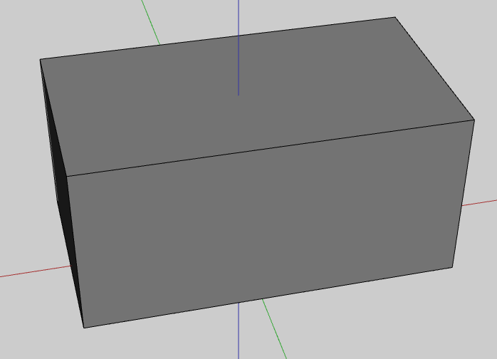

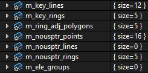

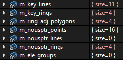

```
我现在要从逻辑上，梳理整个流程，我的动作就是：最开始创建一个矩形，然后对该矩形沿法线挤出，然后再选生成的立方体的侧面，然后再沿法线挤出

我现在要从逻辑上彻底理解，所以请你根据代码中变量的含义，针对下面的代码：

void GeoData::delete_polygon(SketchPolygonPtr polygon, bool need_delete_line, std::unordered_set<SketchPointPtr>* force_keeped_point_set)
{
    std::unordered_set<SketchLinePtr> line_set;

    if(need_delete_line)
    {
        std::vector<SketchPointPtr> exring_pt_arr;
        get_element_points(polygon->ring, exring_pt_arr);
        for(int i = 0; i < exring_pt_arr.size(); ++i)
        {
            SketchPointPtr prev_pt = exring_pt_arr[i];
            SketchPointPtr next_pt = exring_pt_arr[(i + 1) % exring_pt_arr.size()];

            const size_t line_key = GeoData::line_key(prev_pt, next_pt);
            line_set.insert(m_key_lines.at(line_key));
        }

        for(auto& inner_ring: polygon->inner_rings)
        {
            std::vector<SketchPointPtr> inring_pt_arr;
            get_element_points(inner_ring, inring_pt_arr);

            for(int i = 0; i < inring_pt_arr.size(); ++i)
            {
                SketchPointPtr prev_pt = inring_pt_arr[i];
                SketchPointPtr next_pt = inring_pt_arr[(i + 1) % inring_pt_arr.size()];

                const size_t line_key = GeoData::line_key(prev_pt, next_pt);
                line_set.insert(m_key_lines.at(line_key));
            }
        }
    }

    _delete_polygon(polygon);

    if(need_delete_line)
    {
        // 检查所有的 line 是否还被 ring 使用，不被使用的话移除这些 line
        for(auto line: line_set)
        {
            if(get_line_adj_rings(line).empty())
            {
                // add
                std::cout << "Deleting line: " << line->p0->point->idx() << " -> " << line->p1->point->idx() << std::endl;
                // add
                delete_line(line, true, true, force_keeped_point_set);
            }
            else
            {
                // add
                std::cout << "Line still has adjacent rings: " << line->p0->point->idx() << " -> " << line->p1->point->idx() << std::endl;
                // add
                SketchPointPtr p0 = line->p0;
                SketchPointPtr p1 = line->p1;
                GeoDataTopoOperations::get().check_point_and_merge_line(this, p0, force_keeped_point_set);
                GeoDataTopoOperations::get().check_point_and_merge_line(this, p1, force_keeped_point_set);
            }
        }
    }

    // add
    std::vector<SketchPointPtr> polygon_points;
    get_element_points(polygon->ring, polygon_points);

    for(auto point: polygon_points)
    {
        bool has_adj_lines = !get_point_adj_lines(point).empty();
        bool has_adj_rings = !get_point_adj_rings(point).empty();

        std::cout << "Point ID: " << point->point->idx() << " Has Adj Lines: " << has_adj_lines << " Has Adj Rings: " << has_adj_rings << std::endl;

        if(!has_adj_lines && !has_adj_rings)
        {
            std::cout << "Deleting Point ID: " << point->point->idx() << std::endl;
            m_nousptr_points.erase(point->point);
            m_nous_mesh->delete_point(point->point->idx());
        }
    }
    // add

    m_dirty_flags |= 0x1;
    m_dirty_flags |= 0x2;
}

你觉得正常的输出应该是怎样的
```

```
现在我要进入inferring_geodata->delete_polygon(polygon, true);，也就是说，我现在进入了：void GeoData::delete_polygon(SketchPolygonPtr polygon, bool need_delete_line, std::unordered_set<SketchPointPtr>* force_keeped_point_set)

各种状态：

执行：std::unordered_set<SketchLinePtr> line_set;，line_set为0
进入：if(need_delete_line)
执行：get_element_points(polygon->ring, exring_pt_arr);，exring_pt_arr的size为4
进入：for(int i = 0; i < exring_pt_arr.size(); ++i)
执行line_set.insert(m_key_lines.at(line_key));几遍之后，line_set为3，也就是line_setyou 0-3，这里似乎正常
执行：_delete_polygon(polygon);，此时polygon的inner_rings=0，polygon的triangles=2，然后我跟进了_delete_polygon(polygon);，没有发现什么异常，包括polygon的parent_polygon也是正常的
进入：for(auto line: line_set)，此时line_set的size为4
进入：if(get_line_adj_rings(line).empty())，说明get_line_adj_rings(line).empty()为true
执行：std::cout << "Deleting line: " << line->p0->point->idx() << " -> " << line->p1->point->idx() << std::endl;，所以在控制台中打印了：Deleting line: 0 -> 2
进入：delete_line(line, true, true, force_keeped_point_set);，此时force_keeped_point_set的里面的地址为空，并且没有执行m_nousptr_points.erase(p0->point);和m_nous_mesh->delete_point(p0->point->idx());和m_nousptr_points.erase(p1->point);和m_nous_mesh->delete_point(p1->point->idx());
```

### 0217

二分找错

【检查】[feat\] 初版 ComplexSurface 适配各项功能](http://newgit.d5techs.com.cn/d5_pcg/sketch/-/commit/9541a742757117ff7468061cd32f6ecf65cb98e3)

```
namespace sketch
Element.h/.cpp

namespace nous
mesh_element.h
```

```
现在我们想梳理这个项目的一些数据结构，这样方便我理清各个变量的意义，如图所示，我现在在想是不是应该先清楚右边的“类型”，再去思考值的变化
```

````
我查看了，主要涉及到mesh_element.h，types.h，以及Element.h/.cpp，现在请你先阅读mesh_element.h和types.h：

mesh_element.h：
```

```

types.h：
```

```

请你结合代码以及项目的功能，梳理出这些变量的实际意义（不需要你列出代码，而是列一个表格，来展示各个变量的作用（包括简要的示例的说明）
````

```
可能要修改的：
对 for(auto ring1: line_adj_rings) 加 &
对 for(auto ring2: line_adj_rings) 加 &
```

```
第一次沿法线挤出，执行结果完成一样，但是第二次出问题了，问题集中在Geodata的 if(merge_adj_line) 里面，这里引起了 p0 和 p1 的变化
```


## 代码梳理

```
背景：Win11，VS2022，计算机图形学，几何建模

问题（如图所示）：
1. 图一，我新建了矩形
2. 图二，选择"沿法线挤出"，这个功能的意思是对矩形的面进行法线方向的延展，延展的结果取决于我的鼠标移动，然后鼠标左键指定最终位置，我选中了那个矩形，然后朝着某个方向延展到了图二，形成了一个长方体
3. 图三，在图二的基础上，我选择长方体的另一个面（不是之前自己新建的面，而是通过延展生成的面），我想继续"沿法线挤出"，在鼠标结果中途卡了，应该是有bug

补充：这个功能集中在Controller_Extrude_Polygon.h/.cpp这个类中，但这个类又依赖于Geodata.h/.cpp，在两个月之前，这个功能是没问题的，由于其他的需求，修改了一下Geodata.h/.cpp，然后就出现了这个问题，但这两个类的代码都将近两千行，比较多

你觉得我们应该怎么合作，才能尽快纠正这个错误呢？
```


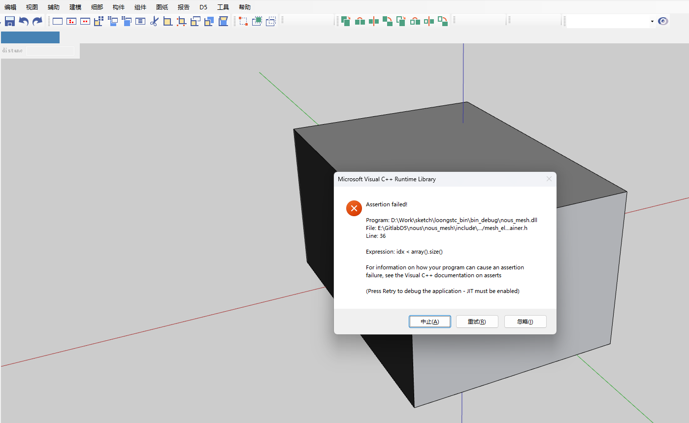

```
我回退到了之前的版本，至少"沿法线挤出"这个功能是没问题的，由于新的需求所以修改了geodata.h/.cpp，而Controller_Extrude_Polygon.h/.cpp是几乎不变的，所以我现在需要根据bug来修改Controller_Extrude_Polygon以适配新的geodata类，所以我才想着对比两个版本的geodata，但是geodata.cpp内容比较多，我先给你提供.h文件的对比：
```

```
我使用了meld来操作，因为更改的地方比较多，部分对比如图所示，但我希望可以和你一起完成这个任务，你觉得我应该提供什么呢？才能让你尽快明白引发bug的核心的geodata的修改区别
```

```
经过我的检查，Controller_Extrude_Polygo的新版本已经完成的修改是：
1. nous::Point*改为了SketchPointPtr
2. m_nousLines的改动与Controller_Extrude_Polyg无关
3. get_polygon_inside改为了get_parent_polygon

也就是说，并不是因为一些替换失误导致的bug，而且其实这种语法替换，一般是不会出错的，现在我希望你根据实际操作步骤（根据选择的矩形面然后延展）结合函数名称，大致猜测，可能出错在什么函数吗，然后我给你提供对应的cpp代码
```

```
我同事跟我说，很可能是与line_key有关，而line_key在新代码中只出现在fix_inferring_mesh_doc函数中，而旧代码中出现在了fix_inferring_mesh_doc和prepare_move_mode_inferring_mesh函数中，但大概率是fix_inferring_mesh_doc的问题，所以我先给你提供fix_inferring_mesh_doc函数的对比，你认真思考line_key的计算与访问
```


